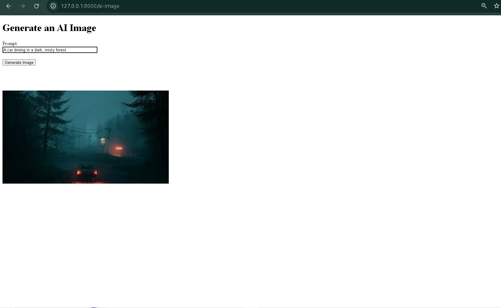

  
  

🚀 AI Assistant Platform (ChatGPT-Like System Built with Laravel + OpenAI)    

📌 Project Overview

This is a full-stack AI assistant web application inspired by ChatGPT.

Built with Laravel, this platform integrates OpenAI APIs to deliver:

AI chat conversations

Image generation

Video generation

Code formatting with syntax highlighting

File upload + analysis

Document summarization

AI content generation

Users can interact with the system exactly like ChatGPT.

This is NOT a template project.
This is a custom AI automation platform.

🧠 Core Features

✅ AI Chat (real-time responses)
✅ Image Generation
✅ Video Generation
✅ File Upload (PDF, DOCX, TXT)
✅ File Analysis
✅ Text Summarization
✅ Code Generation with colorful syntax
✅ Laravel API backend
✅ OpenAI Integration
✅ Secure environment variables
✅ Modular service architecture

🛠 Tech Stack
Backend

Laravel 10

PHP 8+

OpenAI API

Redis

MySQL

Frontend

Blade / Vue.js

Tailwind CSS

JavaScript

AI

OpenAI GPT Models

Image Generation APIs

📂 Architecture Highlights

Service Layer Pattern

API Controllers

Repository Structure

Environment-based configuration

Clean separation between AI logic and UI

Example:

app/
 ├── Services/
 ├── Controllers/
 ├── Interfaces/
 ├── Requests/
 └── Models/

⚙️ Installation
1. Clone Repository
git clone https://github.com/waqar63456/Artificial-Intelligence.git

2. Install Dependencies
composer install
npm install

3. Environment Setup
cp .env.example .env
php artisan key:generate

Add your OpenAI key:

OPENAI_API_KEY=your_key_here

4. Run Project
php artisan migrate
php artisan serve
npm run dev

🔐 Security

API keys stored in .env

.env excluded from GitHub

Input validation

Laravel middleware protection

🎯 Purpose of Project

Built to demonstrate:

Full-stack Laravel development

AI API integration

Real-world system architecture

Clean backend services

Practical AI automation

This project showcases my ability to build production-ready AI platforms.

👨‍💻 Author

Waqar Ahmad
Full Stack Web Developer
Laravel • Vue.js • AI Automation

GitHub: https://github.com/waqar63456/

LinkedIn: https://www.linkedin.com/in/waqarahmadwebdev/

📜 License

MIT License
